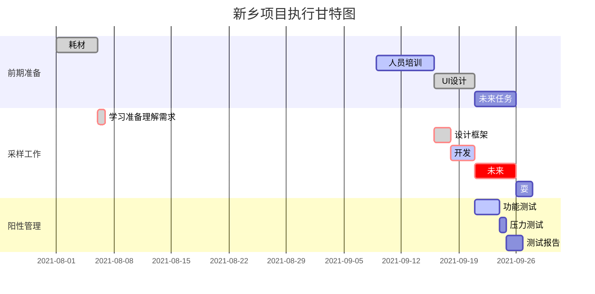

[TOC]

# 新乡项目总结
## 背景
### 项目历史资料
### 2020年新乡项目一览表

|  日期   | 事件  | 人员 |
|  ----  | ----  | --- |
| **单元格**  | 单元格 | --- |
| ---- | ---- | ---- |

```mermaid
        gantt
        dateFormat  YYYY-MM-DD
        title 新乡项目执行甘特图
        section 前期准备
        耗材:done,des1, 2021-08-01,2021-08-06
        人员培训:active,des2, 2021-09-09, 7d
        UI设计:done,des3, after des2, 5d
    	未来任务:des4, after des3, 5d
        section 采样工作
        学习准备理解需求:crit, done, 2021-08-06,23h
        设计框架:crit, done, after des2, 2d
        开发:crit, active, 3d
        未来:crit, 5d
        耍:2d
        section 阳性管理
        功能测试:active, a1, after des3, 3d
        压力测试:after a1  , 20h
        测试报告 : 48h
```