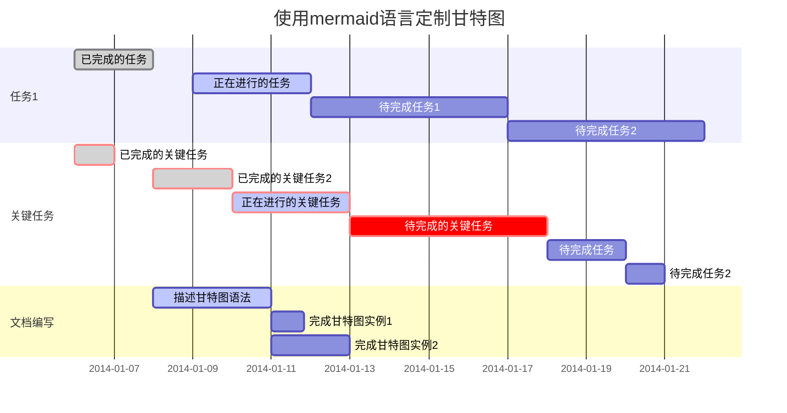
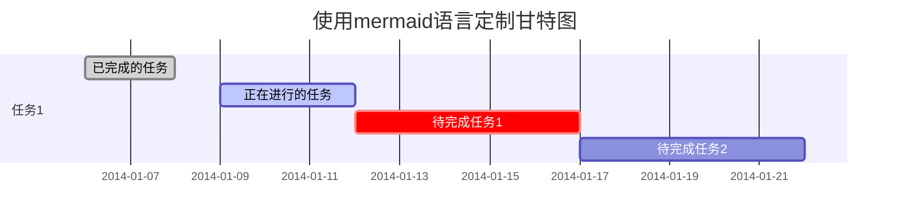

# 甘特图案例

## 1.mermaid关键字说明

mermaid除了绘制甘特图之外，还可以绘制流程图、序列图、统计图表等，下面开始对常用关键字进行说明。

使用印象笔记中的插入甘特图按钮插入一个简单的甘特图实例。

**mermaid：**图中红框第一行内容与最后一行内容，表示当前使用的语言为mermaid。
**gantt：**表示图表类型为甘特图
**dateFormat：**指定日期格式（Y表示年，M表示月，D表示日）。YYYY-MM-DD（2019-03-14），YY-MM-DD(19-03-14)
**section：** 项目关键字，空格之后输入项目名称。
**任务行：** section后每一行为一个任务。第一个字符串为任务名称，之后以:开头，添加任务属性。

接下来用下面代码实例说明常见任务属性。
 **任务状态：**

- **done** 已完成
- **active**正在进行
- **crit** 关键任务
- **默认任务都为待完成状态**

**任务描述：**在des1、des2位置添加任务描述，其它任务引用时直接引用des1就可以。
 **after:** 描述任务时间关系。des3, after des2表示des3紧跟在des2之后。
 **任务时长有三种方式：**

- **时间范围** 如：2014-01-06,2014-01-08
- **指定天数** 如：5d
- **指定开始日期+天数** 如：2014-01-06，5d

**PS:所有关键字之间用“,”分隔，关键字需要属性时用空格分隔(如：after des2,)。

作者：观海_听涛
链接：https://www.jianshu.com/p/a0dabf0b6815
来源：简书
著作权归作者所有。商业转载请联系作者获得授权，非商业转载请注明出处。

